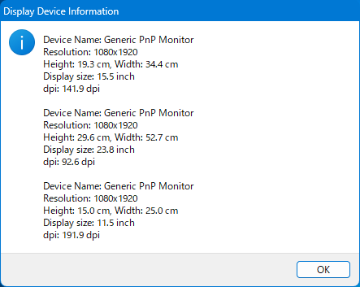

# ディスプレイデバイス情報 Readme

This document is also available in [English](Readme.md).

コンピューターに接続された全てのアクティブモニターの各種情報を表示します。[ゆっくりするブログ : ディスプレイの物理的なサイズを取得する](http://jag5.dreamlog.jp/archives/7949249.html)に掲載のコードをベースにしています。

## 動作要件

**Windows 2000 SP4** 以降（IA-32/AMD64/AArch32/AArch64）

## 実行手順

**Releases** から取得できる以下の実行ファイルの中から、ご使用のコンピュータに合ったものを実行してください。メッセージボックスの形で結果が表示されます。

|  ファイル名   | 対象コンピュータ |
| :-----------: | :--------------: |
|  ddi-32.exe   |    x86 32-bit    |
|  ddi-64.exe   |    x86 64-bit    |
| ddi-arm32.exe |    Arm 32-bit    |
| ddi-arm64.exe |    Arm 64-bit    |

## インストール・アンインストールについて

このソフトウェアはインストール不要です。削除も、そのまま実行ファイルを削除するだけで大丈夫です。レジストリなどは使用していません。

## ソースコードについて

このプロジェクトは、**Visual Studio 2022** で作成されています。

また、動作環境を広げるために **ARM, ARM64** を有効化しています。これらのビルドセットは別途インストールを行わないと使用できません。インストールされていなければ開いたときに求められるので、 **"不足しているプラグインのインストール"** のような旨の項目をクリックしてインストールしてください。なお、ARM, ARM64 用のビルドツールがなくても **x64, Win32 版のビルドは可能**です。

なお、代わりに MinGW_w64 を使用することもできます。その場合は、適切にパスを通したうえで `win.sh` か `win.bat` を実行してください。

ソースコードは **main.cpp**、リソーススクリプトは **resource.rc**、アイコンは **app.ico** です。Visual Studio であれば、**Display Device Information.sln** を開くことでプログラムの編集及びビルドが可能です、

実行可能バイナリは、x86 32-bit は **Win32**、x86 64-bit は **x64**、Arm 32-bit は **ARM**、Arm 64-bit は **ARM64** フォルダの、**Debug** フォルダにデバッグビルド、**Release** フォルダにリリースビルドが生成されます。大量のファイルが生成されますが、exe ファイル 1 つのみで実行できます。

## 使用上の注意

**製作者は、このプログラムの利用によって生じた、いかなる損害についても責任を負いません。**

## 著作権情報など

このソフトウェアは[ゆっくりするブログ : ディスプレイの物理的なサイズを取得する](http://jag5.dreamlog.jp/archives/7949249.html)に記載されているコードに独自の機能を追加する形で制作しました。

私が追加した部分に関しては著作権を放棄しますが、**出典サイトの方は著作権を放棄していない可能性があることに注意してください**。
